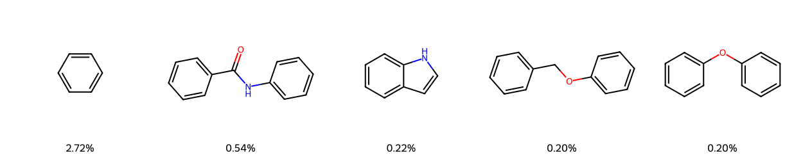

# Generative AI-Driven Design and Machine Learning Prediction of Inhibitors Targeting Plasmodium falciparum Dihydrofolate Reductase–Thymidylate Synthase.
---
## 🔬 Project Overview
This project integrates generative AI, machine learning, and virtual screening to design and evaluate novel inhibitors against Plasmodium falciparum, a malaria-causing parasite. The pipeline fine-tunes the REINVENT framework to generate chemically diverse and biologically relevant molecules, employing an ML-based architecture to predict inhibition activity. 

The workflow fine-tunes the **REINVENT** model to generate new chemical scaffolds and employs **ML**, to classify compounds as *active* or *inactive*.  

By coupling **generative design** with **activity classification**, this project offers an intelligent cheminformatics framework that accelerates early-stage antimalarial discovery.
---

## ⚗️ Objectives
1. Generate novel antimalarial scaffolds using **REINVENT**.  
2. Fine-tune the generative model on curated *Plasmodium* inhibitors.  
3. Classify compounds using **Machine Learning** into *active* and *inactive*.  
4. Perform **virtual screening** for drug-likeness and synthetic feasibility.  
5. Compare **fine-tuned vs. prior** models using quantitative and visual metrics.  
---

## 🧩 Workflow Summary
| Stage | Tool/Model | Description |
| ------ | ----------- | ------------ |
| 1️⃣ Data Curation | ChEMBL, RDKit | Curate *Plasmodium* inhibitor dataset |
| 2️⃣ Generative Modeling | REINVENT | Train and fine-tune prior generative model |
| 3️⃣ Classification | ML | Classify generated molecules (Active/Inactive) |
| 4️⃣ Virtual Screening | RDKit, QED, Lipinski, SAScore | Evaluate physicochemical and ADME properties |
| 5️⃣ Comparative Analysis | Python, t-SNE, Similarity | Quantify novelty, diversity, and model learning |

---

## 🧠 Key Analyses
- **NLL vs. Similarity** — Quantify model learning behavior between fine-tuned and prior REINVENT models.  
- **Similarity Distribution** — Measure novelty and chemical diversity across model generations.  
- **t-SNE Visualization** —  
  - Compare Prior vs. Fine-tuned molecules  
  - Compare finetuned molecules vs. *P. falciparum* (PDB: 7F3Y) inhibitors  
- **Descriptor Distribution** — Compare four key molecular descriptors across Prior, Fine-tuned, and ChEMBL sets.  
- **Scaffold Analysis** — Examine scaffold overlap and diversity for chemical innovation.
- **The Tanimoto coefficient has a range from 0 to 1 where higher values indicate greater similarity in structures.**
- ## 📊 Model Performance Visualizations
---
## 📊 Model Performance Visualizations

<table>
  <tr>
    <td align="center">
       
      
Prior Scaffold Distribution

    </td>
    <td align="center">
       
      
Comparative Analysis

    </td>
  </tr>
  <tr>
    <td align="center">
       
      
Confusion Matrix (Best Model)

    </td>
    <td align="center">
       
      
t-SNE Plot

    </td>
  </tr>
  <tr>
    <td align="center">
       
      
t-SNE (Alternate View)

    </td>
    <td align="center">
       
      
ROC–AUC Curve (Best Model)

    </td>
  </tr>
  <tr>
    <td align="center">
       
      
PAINS Substructure Analysis

    </td>
    <td align="center">
       
      
Tanimoto Similarity (AI Compounds)

    </td>
  </tr>
  <tr>
    <td align="center">
       
      
Finetuned Scaffold Distribution

    </td>
    <td align="center">
       
      
ChEMBL Scaffold Distribution

    </td>
  </tr>
</table>

## 🧪 Drug-Likeness and Screening
Generated molecules undergo a multi-stage filtering process:
- **Lipinski’s Rule of Five** — Drug-likeness constraints  
- **QED** — Quantitative estimate of drug-likeness  
- **SAScore** — Synthetic accessibility evaluation  
- **PAINS Filter** — Removal of assay interference compounds  

---

## 📊 Evaluation Metrics (Classification)
Model performance is evaluated using standard classification metrics:

| Metric | Description |
|---------|-------------|
| **Accuracy** | Proportion of correctly classified compounds. |
| **Precision** | Measures purity of predicted actives (TP / (TP + FP)). |
| **Recall (Sensitivity)** | Measures completeness of actives retrieved (TP / (TP + FN)). |
| **F1-Score** | Harmonic mean of Precision and Recall, balancing both. |
| **ROC AUC** | Measures the ability to distinguish between actives and inactives. |
| **AUPRC** | Precision-Recall trade-off, robust for imbalanced datasets. |
| **Confusion Matrix** | Summarizes model performance across predicted vs. true classes. |
| **NLL (Negative Log-Likelihood)** | Evaluates REINVENT model performance on molecular generation. |
| **Tanimoto Similarity** | Assesses structural diversity across generated compounds. |

---

## 📈 Expected Results
- Fine-tuned model exhibits **lower NLL** and improved **structural relevance**.  
- **Higher classification accuracy (F1 ≥ 0.61)** for ML on generated molecules.  
- **t-SNE plots** reveal distinct distribution patterns between fine-tuned and prior models.  
- Generated compounds meet **Lipinski**, **QED**, and **PAINS** criteria.  
- Enhanced **scaffold diversity** and **novelty (>80%)** in generated molecules.  

---

## 🧬 Technological Stack
| Category | Tools/Frameworks |
|-----------|------------------|
| Generative Modeling | REINVENT 4.0 |
| Classification Model | Machine learning |
| Data Handling | RDKit, Pandas, NumPy |
| Visualization | Matplotlib, Seaborn, t-SNE |
| Screening | QED, Lipinski, SAScore, PAINS |
| Environment | Python 3.10.18, Conda, PyTorch |

---
## Models and Performance

The performance of five machine learning models on the test dataset is summarized below:

| Model               | Test Accuracy | Test F1-score | ROC AUC | AUPRC |
| ------------------- | ------------- | ------------- | ------- | ----- |
| CatBoost            | 0.6324        | 0.6135        | 0.74    | 0.61  |
| XGBoost             | 0.6324        | 0.6078        | 0.71    | 0.55  |
| RandomForest        | 0.6176        | 0.5952        | 0.75    | 0.64  |
| Logistic Regression | 0.6912        | 0.6225        | 0.68    | 0.56  |
| LightGBM            | 0.6324        | 0.6078        | 0.76    | 0.63  |

**Interpretation:**  
- Interestedly, **LightGBM achieves the highest ROC AUC and competitive AUPRC**, making it more suitable for **ranking and separating classes**, which aligns with the primary goal of this study.  
- LightGBM is therefore selected as the **best model** for predicting antimalarial activity of compounds from *Ai-generated-compounds*.

## 🧠 Scientific Significance
This research integrates **deep generative chemistry** with **machine learning** for targeted antimalarial discovery.  

By uniting REINVENT’s **chemical creativity** and ML’s **structure-activity learning**, this study establishes a forward-looking paradigm for **AI-guided antimalarial compound design**, combining molecular innovation, interpretability, and biological relevance.

---

## 🧭 Future Directions
- Integrate **reinforcement learning–based scoring** for *target-aware* molecular optimization.  
- Expand classification to **multi-target inhibitor prediction**.  
- Implement **Explainable AI (XAI)** for interpretability of GNN decision boundaries.  
- Incorporate **ADMET and toxicity prediction** to enhance preclinical translation.

---
## 👨‍🔬 Author
**Izuagba Favour Ogadinma**  
*Research Assistant |  Chemsolvers Research and Computational Laboratories  
Federal University of Technology, Owerri, Nigeria 

## 🧭 Contact

📧  izuagbafavour@gmail.com

🔗 LinkedIn: linkedin.com/in/izuagbafavourogadinma

## 🌍 Citation
If you use this repository or workflow in your research, please cite as:

> **Izuagba Favour Ogadinma** (2025). * Generative AI-Driven Design and Machine Learning Prediction of Inhibitors Targeting Plasmodium falciparum Dihydrofolate Reductase–Thymidylate Synthase.* GitHub Repository.

# ✨ “Combining chemistry, computation, and curiosity to discover tomorrow’s medicines.”
